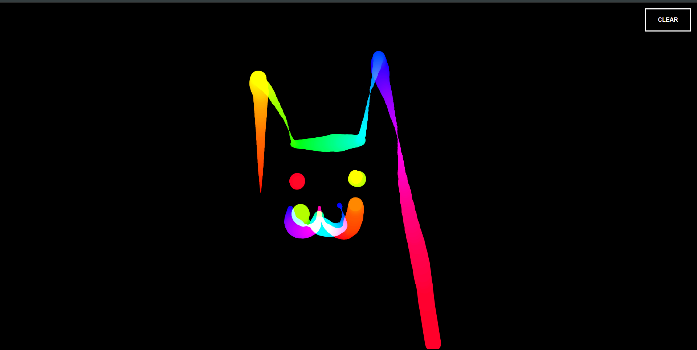

# Important
This initially only supports the mouse events, making it non-functional on Android or any touch-screen devices.

So i will update the code ASAP to handle touch events (`touchstart`, `touchmove`, `touchend`), making it compatible with touch devices.

# Canvas Drawing App

This is a simple drawing application built with HTML, CSS, and JavaScript. The app allows you to draw on a canvas with dynamically changing colors and line widths. You can also clear the canvas with a button click.

## Preview

## Features

- **Colorful Drawing**: The stroke color changes continuously through the hue spectrum (HSL).
- **Dynamic Line Width**: The line width increases and decreases between 1 and 50 pixels as you draw.
- **Smooth Lines**: The lines have rounded ends and corners for smooth drawing.
- **Clear Canvas**: A button is provided to clear the entire canvas.

## How It Works

- **Drawing**: Click and drag your mouse on the canvas to start drawing. The line color will shift through the hue spectrum, and the width will grow and shrink as you draw.
- **Clearing**: Click the "Clear Canvas" button to reset the canvas to a blank state.

